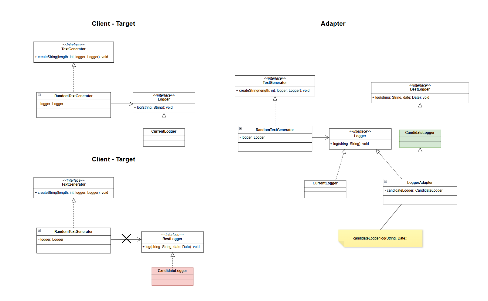

## Design patterns in object orientated programming

Briefly summarization of functionality with different design patterns in object orientated programming. 

### Singleton

The Singleton pattern ensures that only one instance of a class exists and provides a global access point to it. In the case of the TicketDispenser, this guarantees a single instance is responsible for managing ticket dispensing. The instance is created lazily, meaning it is only initialized when first needed. Synchronization is used to lock resources, preventing conflicts with multiple threads.

<strong>Advantages:</strong>
Ensures that only one instance of the class is used, simplifying resource management.
Provides a single point of control for the instance, making it easier to manage shared resources like the ticket dispenser.

<strong>Disadvantages:</strong>
Synchronization can impact performance, especially in applications with high concurrency.

<strong>Similar patterns</strong>
Flyweight

### Adapter (object adapter)

The Adapter is a structural design pattern that leverages interfaces to integrate new components into an application without modifying existing source code. The pattern involves four key components *Client*, *Target*, *Adapter* and *Adaptee*.   

<strong>Advantages:</strong>
Allowing new components to integrate in a system without changing source code.

<strong>Disadvantages:</strong>
Technical Debt - *Code now, pay later* - when implementing new functionality into older systems, adapter is a commonly used solution. The downside is that over time a technical debt is growing and might cause big headach in the future.

<strong>Similar patterns</strong>
Facade, Bridge, Decorator, Proxy

### Facade

The facade is a pattern used to simplify complex relationships and allows us to show one simple facade for the client. This pattern is usually implemented when working with a complicated system.

<strong>Advantages:</strong>
Reduce complexity for the client

<strong>Disadvantages:</strong>
Can be difficult to implement and a low quality might worsen the complexity.

<strong>Similar patterns</strong>
Adapter, Bridge, Mediator

### Proxy

Proxy allows us control access for an object, in this case a singleton.

<strong>Advantages:</strong>
Access, reduce dependency

<strong>Disadvantages:</strong>
negative performance impact

<strong>Similar patterns</strong>
Adapter, Decorator

